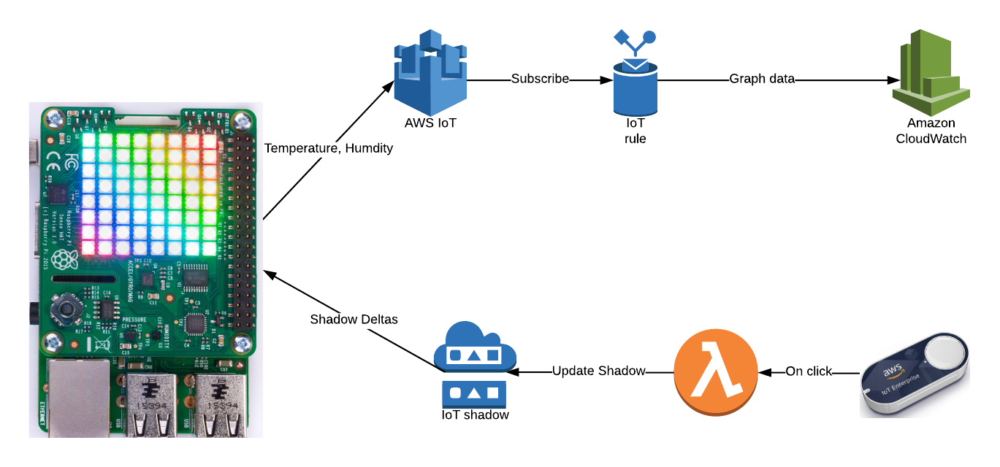

# AWS IoT, IoT 1-Click Enterprise Button, and Raspberry Pi SenseHat Demo

## AWS IoT setup

## AWS IoT 1-Click + Enterprise Button setup

## Raspberry Pi setup

### AWS IoT systemd service

Run the AWS IoT script as a systemd service. See the Raspberry Pi docs for more detail: https://www.raspberrypi.org/documentation/linux/usage/systemd.md

Copy the `aws-iot.service` file to `/etc/systemd/system/aws-iot.service`:

`sudo cp ./aws-iot.service /etc/systemd/system/`

Enable the service:

`sudo systemctl enable aws-iot.service`

Start the service:

`sudo systemctl status aws-iot.service`

Check the status of the service:

`sudo systemctl status aws-iot.service`
